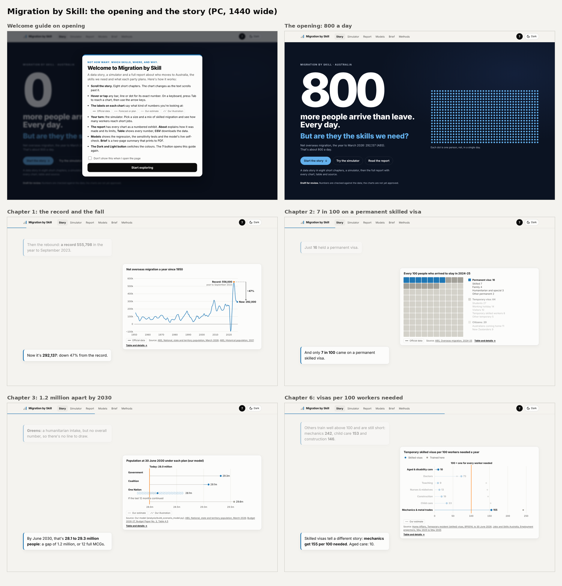

# Migration Skills Forecast

**Not how many. Which skills, where, and why.**

A data project on Australian migration by skill. It brings together official data on population, visas, jobs, training and housing to ask which sectors and regions need workers, how many people Australia trains for them, where skilled visas go, and what each party's migration plan would mean. The dashboard inside is called **Migration by Skill** (working names; the final name is not set).

**Status: draft for review (version 2, 5 October 2026).** The numbers are checked against the data, but the charts are not yet approved, and the fact-check quotes and party positions need a final re-check before anything is published.



## What's in this repository

| Path | What it holds |
|---|---|
| `docs/` | The website: a data story in eight chapters, a "size vs mix" simulator, an analyst report with 20 exhibits, four tools and a Models appendix, a two-page brief and a methods page. Plain JavaScript with D3 v7 and Scrollama; no build step. Named `docs/` so GitHub Pages can serve it directly. |
| `analysis/` | The Python pipeline (`run_all.py` and the `build_*.py` scripts), the analysis tables, `data_dictionary.csv` (every column explained), `row_counts.csv` (rows at each cleaning step) and the `*_checks.json` reconciliation logs. |
| `tidy/` | Cleaned source tables. |
| `data_inventory.csv` | Every source file: where it comes from, what it is, and which script uses it. |
| `review-screenshots/2026-10-05-v2/` | Review sheets of the dashboard on PC and phone, and the brief as a PDF. |

## Open the dashboard

Open `docs/index.html` in a browser. It runs straight from the file, offline, with no server. `docs/brief.html` prints as two A4 pages.

It's also live at [meet2802.github.io/Australian-Migration-Forecast](https://meet2802.github.io/Australian-Migration-Forecast/) via GitHub Pages.

## Rebuild the data

The raw downloads (about 220 MB of files from the ABS, Home Affairs, Jobs and Skills Australia, NCVER, the Department of Education and international agencies) are not in this repository. `data_inventory.csv` lists each one by file name.

1. Put the raw files in the repository root, with the names listed in `data_inventory.csv`.
2. Run `python3 analysis/run_all.py`. It needs Python 3.10 or later with pandas, numpy and openpyxl, and `pdftotext` (Poppler) for the Migration Program report.
3. The last step, `analysis/export_web_data.py`, rewrites `docs/data/` and the CSV copies in `docs/downloads/`.

The cleaned Home Affairs visa tables are already in `tidy/`. To re-extract them from newly published workbooks, run `python3 analysis/visa_extraction/run_extraction.py .`

## Test the dashboard

```
cd docs/tests
npm install
node run_tests.js
```

The headless test checks every chapter, chart, table and link, and compares the numbers on the page with the pipeline's tables (605 checks, all passing on 5 October 2026).

## Sources

Official data from the Australian Bureau of Statistics, the Department of Home Affairs, Jobs and Skills Australia, NCVER, the Department of Education and the Treasury, with comparisons from the World Bank, the UK Office for National Statistics, Statistics Canada and the US Census Bureau. Every chart names its source, and `data_inventory.csv` and the dashboard's methods page list them in full. Check each publisher's terms before reusing their data.

## Ground rules

- Skills, not nationality: the work looks at jobs, skills and places, never at where people come from.
- Every number is labelled as official data, a forecast or plan, our estimate, or our illustration.
- Every side's claims are tested to the same standard.

## Licence

- **Code** (the Python scripts, the dashboard's HTML, JavaScript and CSS, and the tests): MIT, see [`LICENSE`](LICENSE).
- **Data, text and charts** (the tables in `tidy/` and `analysis/`, the dashboard's words, data files, downloads and charts, and the review sheets): CC BY 4.0, see [`LICENSE-DATA`](LICENSE-DATA). Credit Meet Sharma and the original source.
- The source data stays under its publishers' terms, and D3 and Scrollama keep their own licences in `docs/vendor/`.

Made by Meet Sharma.
